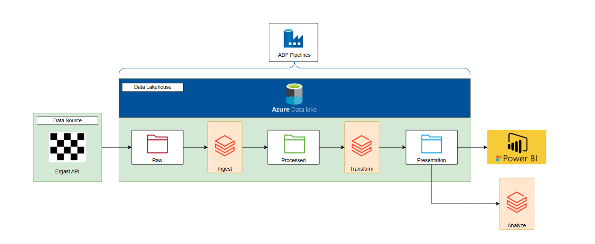
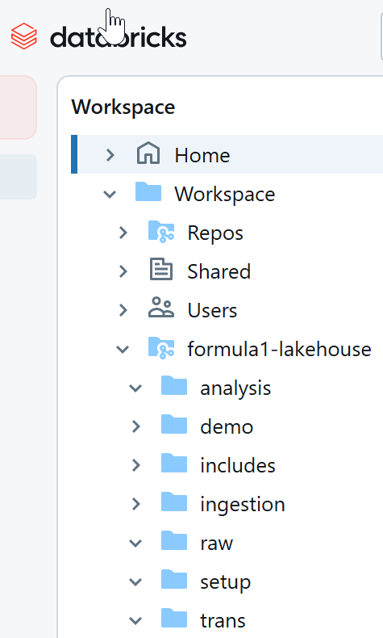
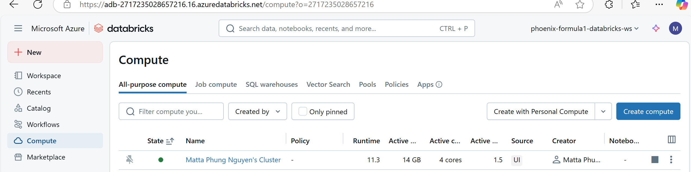
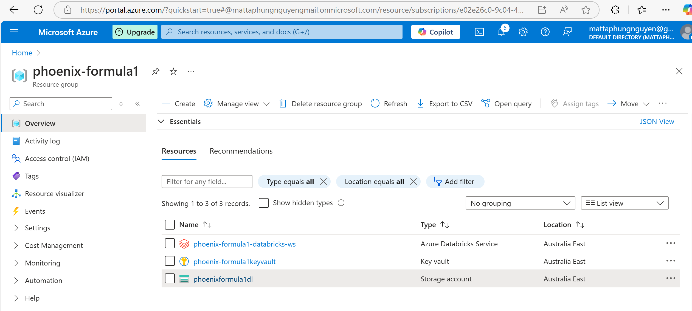
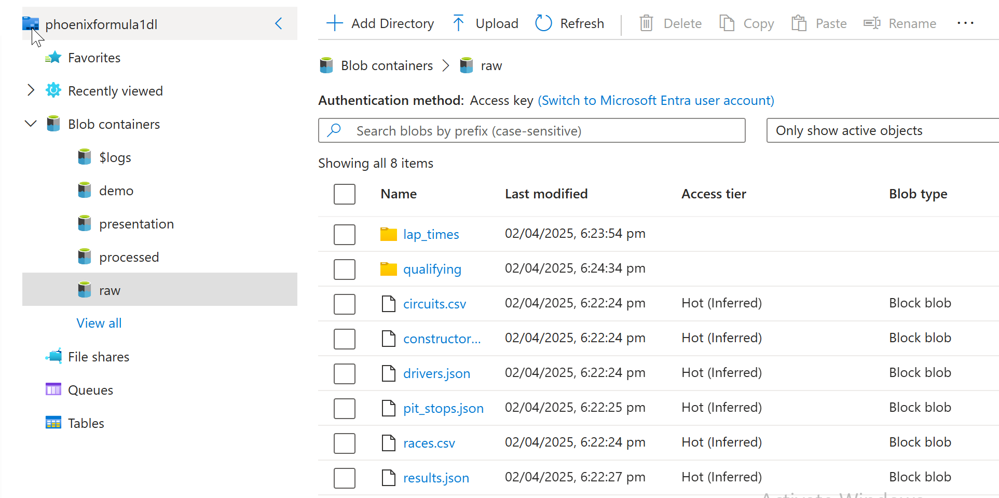
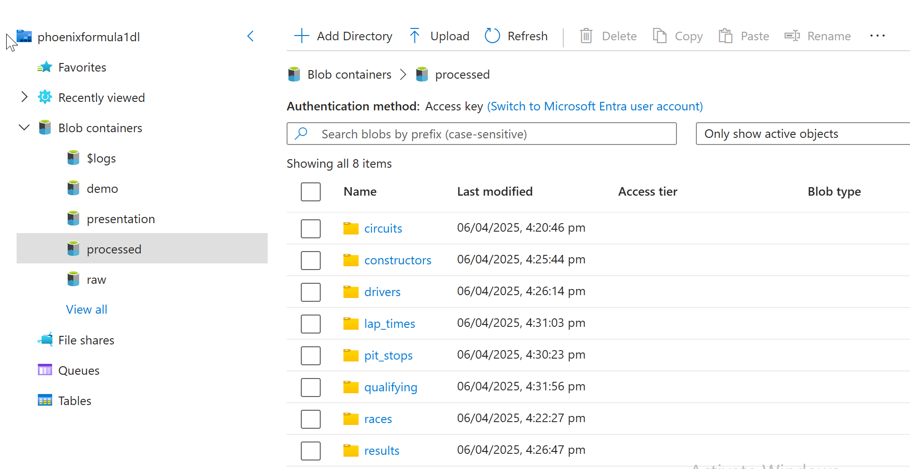
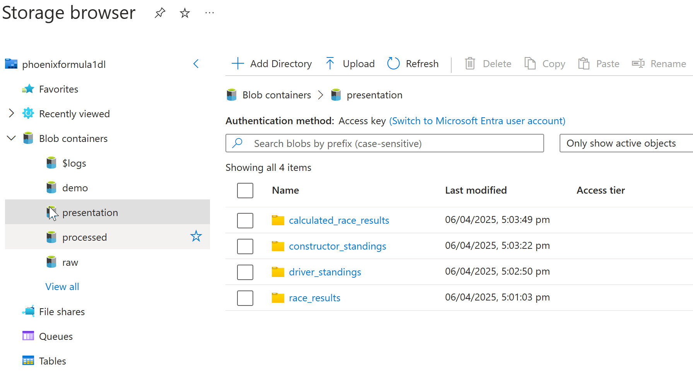
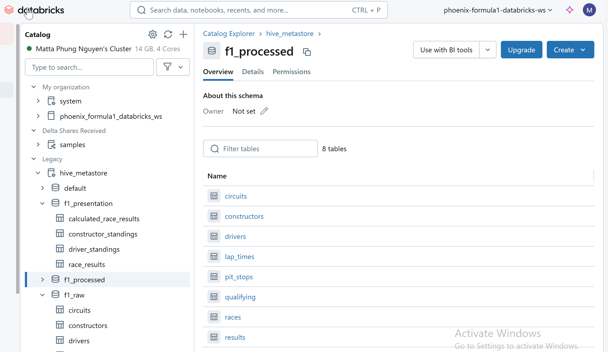
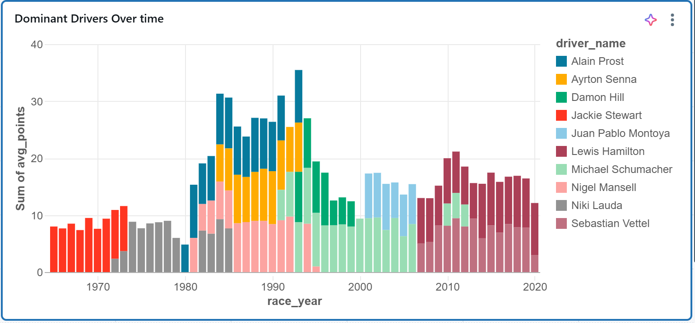
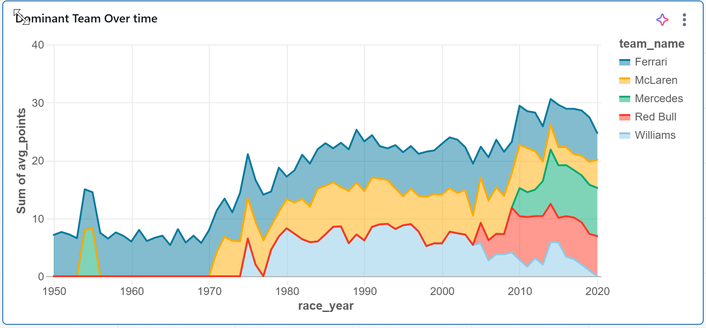

# Formula1 Lakehouse

## Overview

## Table of contents

## Architecture

## Project Structure

- 📂 **PhoenixPhungNguyen-formula1-lakehouse/**
  - 📄 README.md
  - 📂 images/
  - 📂   
  - 📂   
  - 📂 
  - 📂 
  - 📂 
  - 📂

## Data Source
Covid 19 Data in Europe from website https://www.ecdc.europa.eu/en

## Tech Stack

**1. Azure Databricks** 

- Workspace:
  
   
- Compute:
  
   

**2. Azure Data Lake Gen 2**

- resource group
  
  
- raw
 

- process
  

- presentation
  

**3. Databrick Catalog-Hive Metastore**

**4. Analyze**

- ****
  

 

